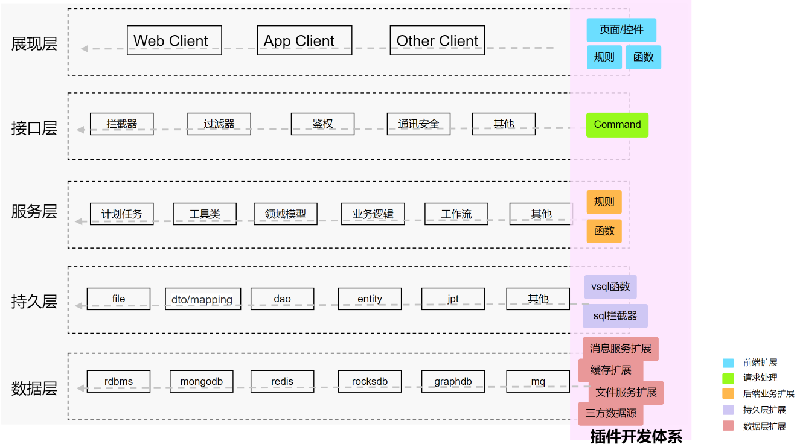
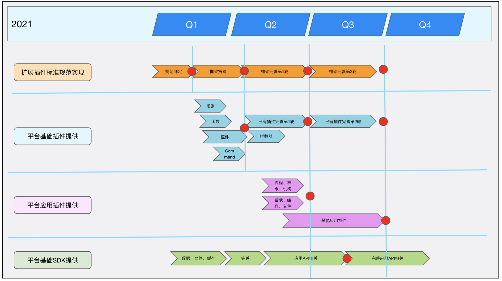

# 插件开发指南

## **前言**

[V-DevSuite(银弹谷零代码开发工具套件)](http://www.yindangu.com)是运用先进的管理理念和设计方法构建的新一代零代码、可视化软件应用开发平台，可以通过拓展插件解决差异化的平台需求。

本文既适用于V-DevSuite应用开发者，也可供希望理解V-DevSuite插件原理和实现的高级用户参考。

## **简介**

### **什么是V-DevSuite插件**

V-DevSuite(银弹谷零代码软件开发套件)通过拖、拉、拽配置和模块化组装，软件企业和个人开发者可快速构建覆盖PC、手机（平板）、智能设备等多终端的软件应用程序。

对于一个企业级应用服务平台，一个庞大、臃肿的软件，并不是我们的设计目标。因此，我们把V-DevSuite产品目标定位成更轻量、更开放的架构，通过不断扩展的插件来适应不同的需求场景，成为一个支持个性化定制的平台。

V-DevSuite只关注基础功能的提供（如：基础规则、函数、控件、表设计、查询...），基础应用的提供（如：流程、权限、组织、登录、账户、门户、定时任务、事项消息...）以及模块的管理（如：安装、运行、升级、卸载...），其他技术或平台工具则以插件（Plugin）形式开放给开发者。

### **插件与V-DevSuite的关系**

* 所有V-DevSuite插件以构件方式安装到V-DevSuite，可上传至VStore（云仓库）并使用[VTeam](http://team.yindangu.com)（软件开发协同工具）进行构件清单的管理。
* V-DevSuite对所有开发者扩展的V-DevSuite插件都是一致对待处理的
* V-DevSuite插件可以随V-DevSuite安装、升级和卸载，不会影响V-DevSuite的运行

### **V-DevSuite支持的插件类型**

（持续更新中...）

| 类型      | 说明                                                                                                                                                                                                                                                                 |
| ------- | ------------------------------------------------------------------------------------------------------------------------------------------------------------------------------------------------------------------------------------------------------------------ |
| 规则      | 
V-DevSuite中的基本业务逻辑单元，多个规则可通过if、else、for each组成一个规则链，形成业务逻辑片段，供界面或后端的事件（如：表单加载事件、按钮按下事件、流程启动事件、任务提交事件...）触发执行。

规则有客户端与服务端之分，客户端规则执行纯js代码逻辑，在浏览器运行，服务端规则执行纯java代码逻辑，在jvm运行。

V-DevSuite提供了丰富的通用规则库，能够覆盖大多数业务场景，对于定制化的场景，可以通过二次开发V-DevSuite规则插件来满足。
 |
| 函数      | 
V-DevSuite中的基本业务逻辑单元，函数在表达式中执行，表达式支持多个函数的嵌套执行。表达式通常在执行表达式规则或规则链中的if判断表达式中执行。

函数有客户端与服务端之分，客户端函数执行纯js代码逻辑，在浏览器运行，服务端函数执行纯java代码逻辑，在jvm运行。

V-DevSuite提供了丰富的通用函数库，能够覆盖大多数业务场景，对于定制化的场景，可以通过二次开发V-DevSuite函数插件来满足。
                                  |
| 控件      | 
V-DevSuite中的页面元素单元（如：窗体、按钮控件、表格控件、文本控件...），通过拖、拉、拽配置窗体中的控件，控件中的事件配置（如：窗体加载后事件，按钮点击后事件，表格行切换事件...）。

控件有移动端、PC端之分，执行纯js代码逻辑，在浏览器运行。

V-DevSuite提供了丰富的控件库，能够覆盖大多数业务场景，对于定制化的场景，可以通过二次开发V-DevSuite控件插件来满足。
                                           |
| Command | 
用于处理HTTP的请求与响应（类似：Servlet）

Command执行纯java代码，在jvm中运行。

可以通过二次开发V-DevSuite Command插件来完成HTTP请求的的处理及响应。
                                                                                                                                              |

### **为什么要用V-DevSuite插件**

V-DevSuite插件开发与基于其他开源平台与商业软件的开发，具备以下优势：

* 接口简单，易于开发
* 不侵入框架代码，让开发人员专注于业务逻辑的实现
* 插件以构件（模块）方式进行统一的部署，管理，分发

## **插件的构成**

### **V-DevSuite扩展机制的总体结构**

### 按Web开发划分

#### **后端插件**

后端插件包（jar包）包括：

1. 插件注册器实现：用于收集各个后端插件的元信息
2. 插件接口实现实现：各个后端插件的接口（interface）实现
3. 第三方依赖jar包：插件需要使用到的第三方依赖jar，需统一放到jar包的lib目录下

后面章节会详细讲解后端插件包的构成及开发过程

#### **前端插件**

前端插件包（zip包）包括：

1. manifest.json文件：用于描述前端插件元信息
2. 目标文件：即前端插件的源码js文件
3. 其他文件：如debug相关的资源文件，第三方依赖的资源文件

后面章节会详细讲解前端插件包的构成及开发过程

## V-DevSuite插件扩展机制实现的规划路线图

